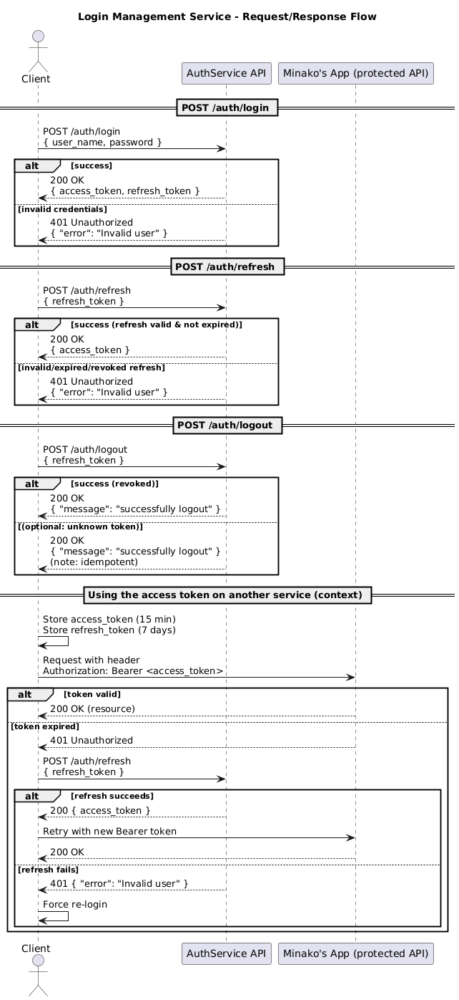

# Login Management Service (Minako)

Three REST endpoints:
- `POST /auth/login` → `{ access_token, refresh_token }`
- `POST /auth/refresh` → `{ access_token }`
- `POST /auth/logout` → `{ "message": "successfully logout" }`
- Health: `GET /health` → `{ "status":"ok" }`

## Runing the service (local)
```bash
python -m venv .venv && source .venv/bin/activate
pip install -r requirements.txt
export JWT_SECRET="super-secret-key"
python app.py  # or: uvicorn app:app --port 8000 

```

## Running the service (live)
**Dev**:
```bash
uvicorn app:app --reload --port 8000   # --reload = auto-restarts on code changes (dev only)
```

**Prod**:
```bash
uvicorn app:app --host 0.0.0.0 --port 8000  # run under a process manager or Docker
```

**_Note_**: Uvicorn is the ASGI (Async Server Gateway Interface) web server that runs the FastAPI app (it’s what listens on the port and serves requests).

## Test
```bash
pytest -q
```

## To start the server (dev):
```bash
uvicorn app:app --reload --port 8000
# Base URL (dev): http://127.0.0.1:8000
```
All requests: JSON over HTTP

Header: Content-Type: application/json

## Create Session (LOGIN)
Method: POST
Endpoint: /auth/login
Request body:
```json
{
  "user_name": "M.Koike",
  "password": "pass0000"
}
```
Success (200) returns:
```json
{
  "access_token": "<jwt-string>",
  "refresh_token": "<random-refresh-token>"
}
```
Failure (401) returns:
``` json
{
  "error": "Invalid user"
}
```

## Example call (Bash with httpie):
``` bash
http POST :8000/auth/login user_name="M.Koike" password="pass0000"
```
### Store both tokens locally:

``` bash
access_token=$(http POST :8000/auth/login user_name="M.Koike" password="pass0000" | jq -r '.access_token')
refresh_token=$(http POST :8000/auth/login user_name="M.Koike" password="pass0000" | jq -r '.refresh_token')
```

## Reissue Access Token (REFRESH)
Method: POST
Endpoint: /auth/refresh
Request body:

``` json
{
  "refresh_token": "<refresh-token-from-login>"
}
```
Success (200) returns:
``` json
{
  "access_token": "<new-jwt-string>"
}
```
Failure (401) returns:
```json
{
  "error": "Invalid user"
}
```
### Example call (Bash):

```bash
http POST :8000/auth/refresh refresh_token="$refresh_token"
```

## Invalidate Session (LOGOUT)
Method: POST
Endpoint: /auth/logout
Request body:

```json
{
  "refresh_token": "<refresh-token-to-revoke>"
}
```
Success (200) returns:
```json
{
  "message": "successfully logout"
}
```
Example call (Bash):
```bash
http POST :8000/auth/logout refresh_token="$refresh_token"
```

## UML



